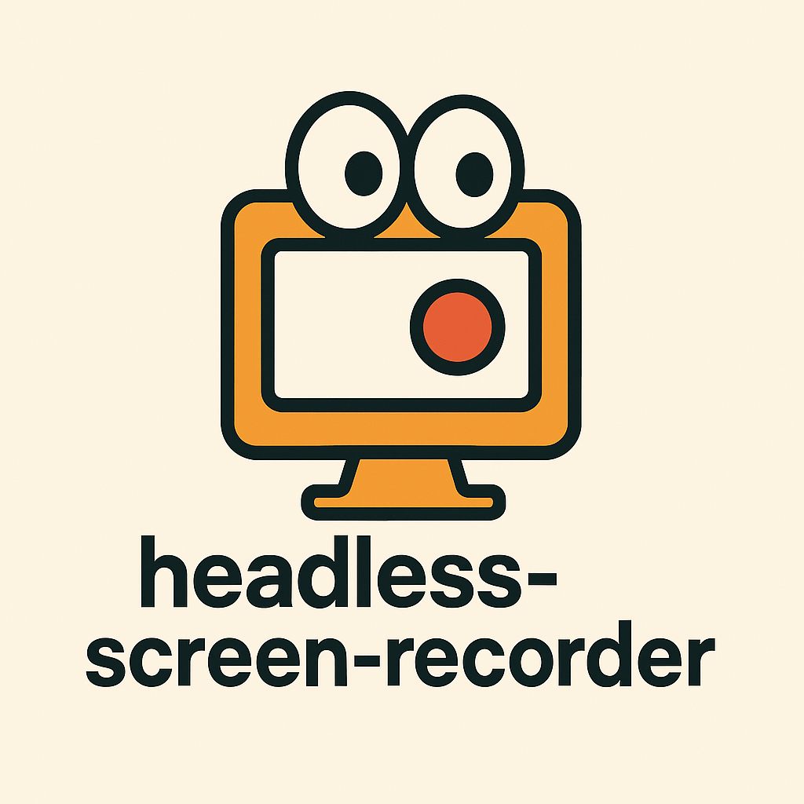

<div align="center">
  
  
  # headless-screen-recorder

  A Puppeteer plugin optimized for headless Chrome using the modern `HeadlessExperimental.beginFrame` API for reliable video capture with professional color correction.

  [](https://npmjs.org/package/headless-screen-recorder)

  
  
  
</div>

## Key Features

- 🎯 **Optimized for Headless Chrome** - Built specifically for headless environments using modern Chrome DevTools Protocol
- 🎨 **Professional Color Correction** - Automatic color space conversion from BT.601 to BT.709 for broadcast-standard output
- ⚡ **Reliable Frame Capture** - Uses `HeadlessExperimental.beginFrame` API instead of deprecated `Page.screencastFrame`
- 🔧 **Simplified Architecture** - No complex session management, popup handling, or tab following overhead
- 📹 **High-Quality Output** - Supports MP4, AVI, MOV, and WebM formats with configurable quality settings

## Installation

Using npm:
```sh
npm install headless-screen-recorder
```

Using yarn:
```sh
yarn add headless-screen-recorder
```

## Quick Start

```javascript
const { PuppeteerScreenRecorder } = require('headless-screen-recorder');
const puppeteer = require('puppeteer');

(async () => {
  const browser = await puppeteer.launch({ headless: true });
  const page = await browser.newPage();
  
  const recorder = new PuppeteerScreenRecorder(page, {
    fps: 25,
    ffmpeg_Path: '<path to ffmpeg>',
    videoFrame: {
      width: 1920,
      height: 1080,
    },
    aspectRatio: '16:9',
  });
  
  await recorder.start('./output.mp4');
  await page.goto('https://example.com');
  
  // Perform actions...
  
  await recorder.stop();
  await browser.close();
})();
```

## API Documentation

### Constructor Options

```typescript
interface PuppeteerScreenRecorderOptions {
  fps?: number;                    // Frames per second (default: 25)
  quality?: number;                // Video quality 0-100 (default: 80)
  ffmpeg_Path?: string;            // Path to FFmpeg executable
  videoFrame?: {                   // Video dimensions
    width: number;
    height: number;
  };
  aspectRatio?: string;            // Video aspect ratio (default: '4:3')
  recordDurationLimit?: number;    // Maximum recording duration
  videoCrf?: number;               // Constant Rate Factor (default: 23)
  videoCodec?: string;             // Video codec (default: 'libx264')
  videoPreset?: string;            // Encoding preset (default: 'ultrafast')
  videoBitrate?: number;           // Video bitrate in kbps (default: 1000)
  autopad?: {                      // Auto-padding options
    activation: boolean;
    color?: string;
  };
  format?: 'jpeg' | 'png';         // Screenshot format (default: 'jpeg')
}
```

### Methods

#### `start(savePath: string): Promise<void>`
Start recording to a file.

#### `stop(): Promise<void>`
Stop the recording and save the video.

## What Makes This Different?

### From puppeteer-screen-recorder

This fork addresses several critical issues with the original package:

1. **Modern CDP API**: Uses `HeadlessExperimental.beginFrame` instead of the deprecated `Page.screencastFrame`
2. **Color Accuracy**: Automatic color space conversion ensures videos look correct without post-processing
3. **Simplified Code**: Removed complex session management, making it more reliable and easier to maintain
4. **Headless Optimized**: Specifically designed for headless Chrome environments

### Technical Improvements

- **Color Correction**: Converts from PC range BT.601 (computer graphics) to TV range BT.709 (broadcast standard)
- **Reliable Capture**: Simple interval-based polling instead of complex event-driven architecture
- **Better Error Handling**: Enhanced FFmpeg error logging for easier debugging

## Migration Guide

If you're migrating from `puppeteer-screen-recorder`:

```javascript
// Before
const { PuppeteerScreenRecorder } = require('puppeteer-screen-recorder');

// After
const { PuppeteerScreenRecorder } = require('headless-screen-recorder');
```

The API remains fully compatible, so no other code changes are needed.

## Requirements

- Node.js >= 16
- Puppeteer >= 19.0.0
- FFmpeg (system installation or via `@ffmpeg-installer/ffmpeg`)
- Chrome/Chromium with HeadlessExperimental API support

## Examples

### Basic Recording
```javascript
const recorder = new PuppeteerScreenRecorder(page);
await recorder.start('./video.mp4');
// ... perform actions
await recorder.stop();
```

### High-Quality Recording
```javascript
const recorder = new PuppeteerScreenRecorder(page, {
  fps: 30,
  quality: 100,
  videoFrame: {
    width: 1920,
    height: 1080,
  },
  videoCrf: 18,  // Lower = better quality
  videoPreset: 'slow',  // Slower = better compression
});
```

### Streaming to a Writable Stream
```javascript
const { createWriteStream } = require('fs');
const writableStream = createWriteStream('./output.mp4');
const recorder = new PuppeteerScreenRecorder(page);
await recorder.start(writableStream);
```

## Troubleshooting

### FFmpeg Not Found
If you get an FFmpeg error, either:
1. Install FFmpeg on your system
2. Use the npm package: `npm install @ffmpeg-installer/ffmpeg`
3. Specify the path: `ffmpeg_Path: '/path/to/ffmpeg'`

### Color Issues
The color correction is applied automatically. If you need different color settings, you can modify the video output options in your configuration.

## Contributing

Issues and pull requests are welcome at [https://github.com/brianbaso/headless-screen-recorder](https://github.com/brianbaso/headless-screen-recorder)

## License

MIT License - see the [LICENSE](LICENSE) file for details.

## Credits

This is a fork of [puppeteer-screen-recorder](https://github.com/prasanaworld/puppeteer-screen-recorder) by Prasana Kannan, optimized specifically for headless Chrome environments with modern CDP APIs and professional video output.